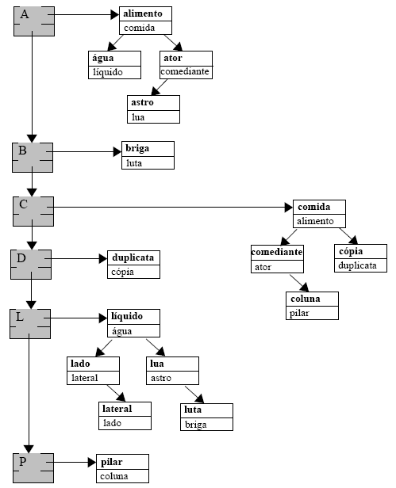
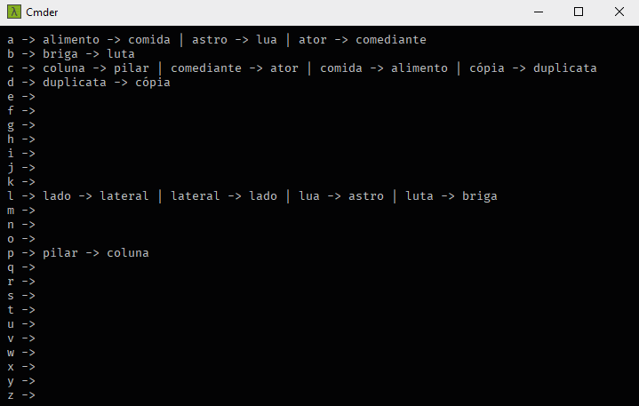

# Words Dictionary

This project implements a linked list and binary trees to build a words dictionary with synonyms

## ☁️ Links

- [Dictionary Specification](docs/pdf/dictionary_specification.pdf)

## 💻 Project

#### Dictionary Structure



#### Showing Dictionary



## 🚀 Technologies

 Java

## 🏃 Usage

Before you start the server theres some commands that you have to run, just copy and paste one by one the commands bellow:

```
git clone https://github.com/douglasJovenil/word-dictionary
cd word-dictionary/src
javac Main.java
java Main
```
